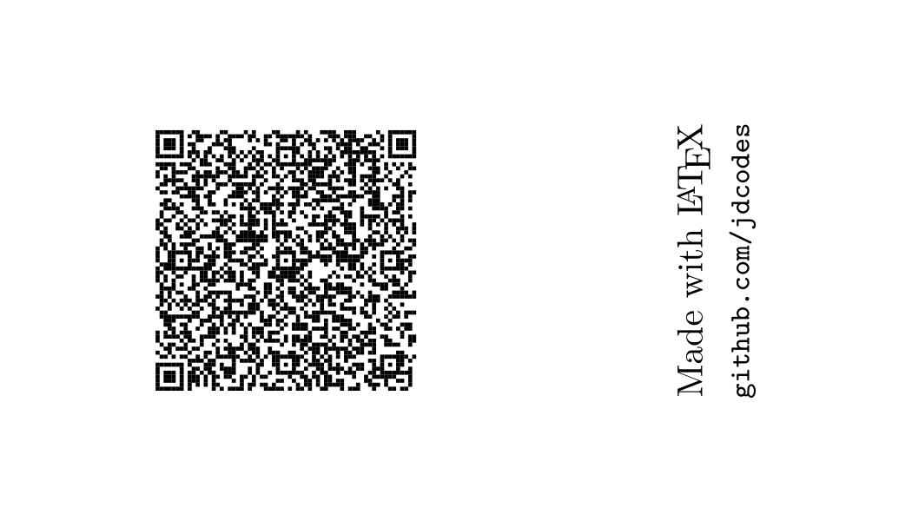

# Business Card

|              Card Front              |             Card Back              |
| :----------------------------------: | :--------------------------------: |
|  |  |

This business card modifies Olivier Pieters's design from [https://github.com/opieters/business-card](https://github.com/opieters/business-card) (See LICENSE.txt). The design has been changed to use a side-by-side layout with an initial on the left and contact information on the right. The back features a QR code that can be scanned to pull up a [vCard](https://en.wikipedia.org/wiki/VCard). Of course, Computer Modern is the star of the show here 😜.

## Usage

- Use the included makefile to build both documents (if using `pdflatex`)

## Contributing

Pull requests are welcome!

## License

[GNU GPLv3](https://choosealicense.com/licenses/agpl-3.0/)
